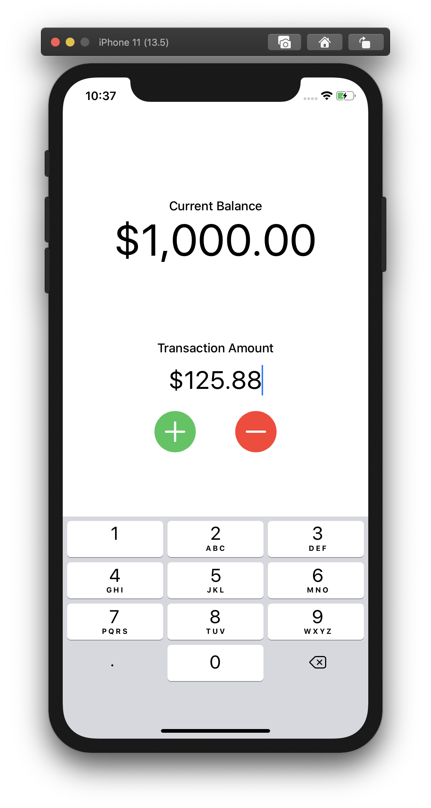
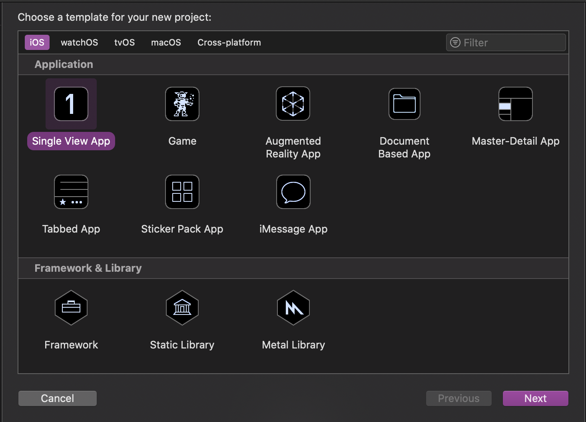
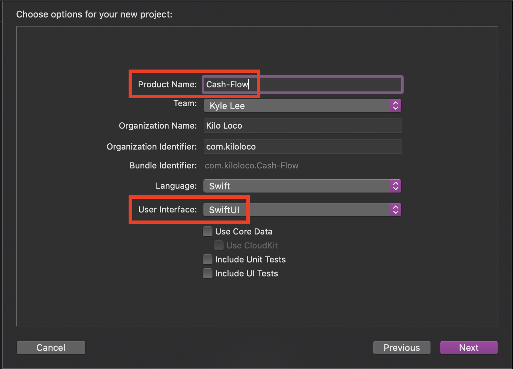
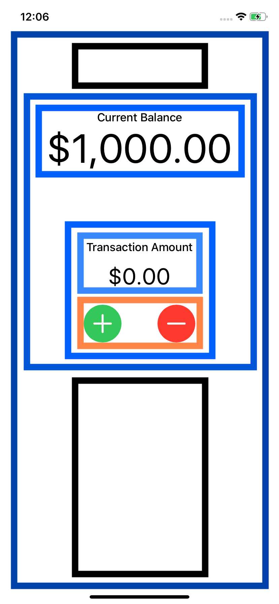
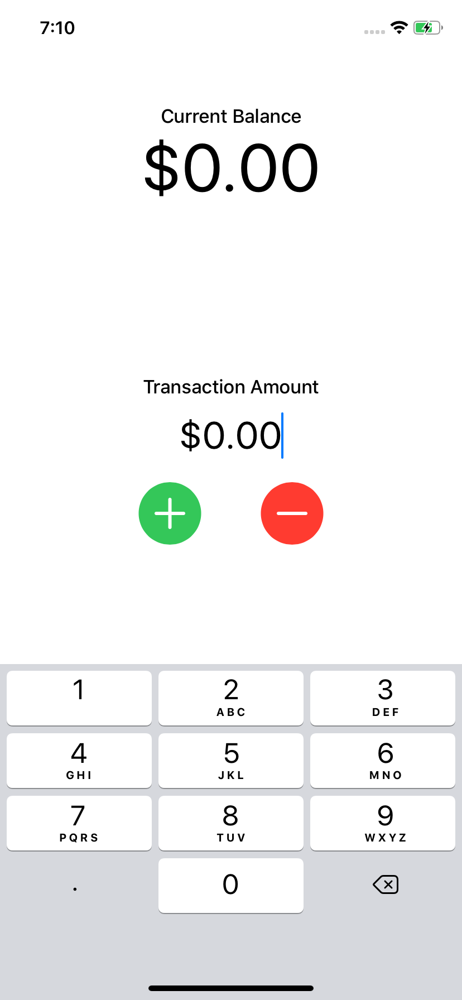
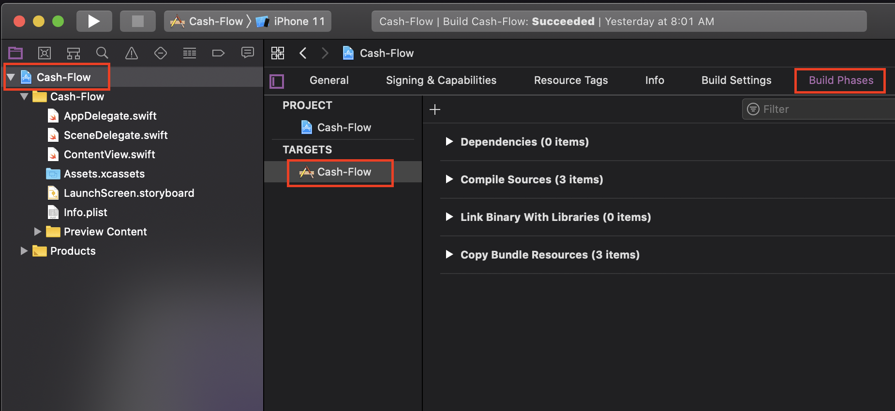
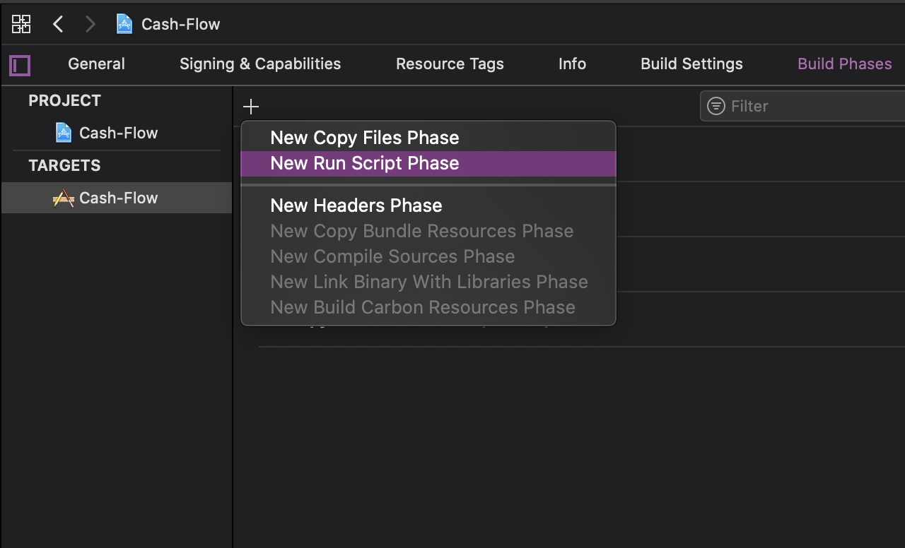
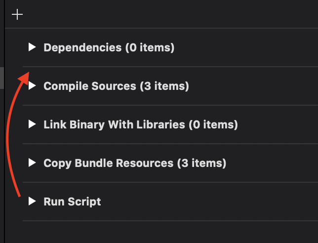
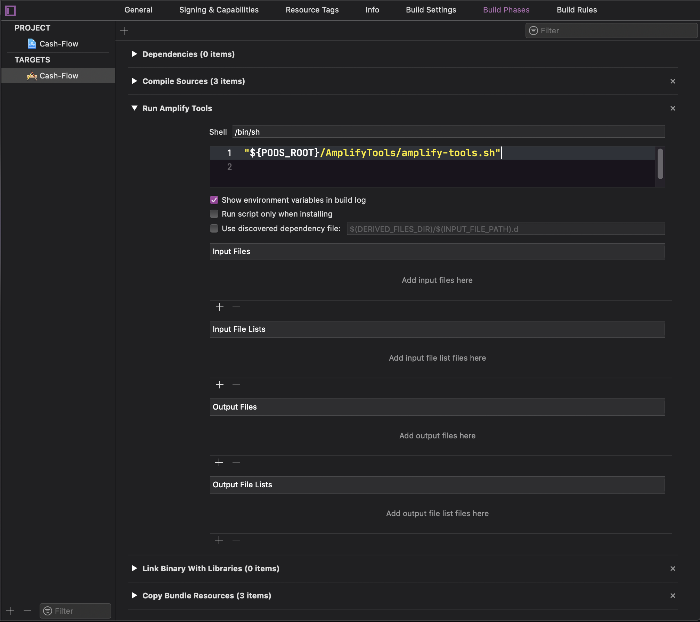

# AWS Amplify DataStore - Cash Flow App
A tutorial focused on building an app that allows the user to track their cash flow by adding and subtracting currency amounts from their total balance. **AWS Amplify DataStore** is used to persist the user's account balance between sessions.




### Topics we'll be covering
- Configuring AWS Amplify
- Simple GraphQL data modeling
- Using AWS Amplify DataStore as a persistence layer
  - Cread
  - Read
  - Update

### Prerequisits
- Install [Node.js](https://nodejs.org/en/) version 10 or higher
- Install [Xcode](https://developer.apple.com/xcode/downloads/) version 10.2 or later
- Install [CocoaPods](https://cocoapods.org/)
- Install [Amplify CLI](https://docs.amplify.aws/cli) version 4.21.0 or later by running:


### Configuring the project
Create a new Single View App.



Name the project whatever you would like; I will be using the name `Cash-Flow`.
> **Note**
>
> It is strongly recommended that your project name does not contain spaces as this could cause complications with `Amplify` as well as any other dependencies you decide to add to the project.



In this tutorial, we will be using `SwiftUI`.


### Laying out the UI
If we examine the UI that we are trying to build, we can see that it is made up of several `VStack` views (shown in shades of blue) and an `HStack` view (shown in orange). We also have some `Spacer` views (shown in black) that help align our content towards the top of the screen.



Let's start building this out in code, starting with each of the stacks views we will be using. In the `body` property of `ContentView.swift`, add the following:
```swift
var body: some View {
    // 1
    VStack {

        // 2
        Spacer()
            .frame(height: 50)
        
        // 3
        VStack {
            Text("Current Balance")
                .fontWeight(.medium)
            
            Text("$0.00")
                .font(.system(size: 60))
        }
        
        // 4
        Spacer()
    }
}
```
1. The `VStack` that will hold all the content on our screen.
2. A `Spacer` that adds 50px of space from the top of the screen.
3. The `VStack` that groups together the "Current Balance" `Text` view and another `Text` view that will be responsible for displaying the dynamic account balance. We are using "$0.00" as a placeholder for now.
4. Another `Spacer` responsible for pushing the content towards the top of the screen.


Next, let's add the `VStack` that is responsible for holding the interactable views (`TextField` and two `Button` views). This will be below the `VStack` holding the Current Balance `Text` view value and above the bottom `Spacer`.
```swift
... // Current balance VStack

// 1
Spacer()
    .frame(height: 150)

// 2
VStack(spacing: 20) {

    // 3
    VStack {
        Text("Transaction Amount")
            .fontWeight(.medium)

        // 4
        TextField("Amount", text: amountFormatterBinding)
            .font(.largeTitle)
            .multilineTextAlignment(.center)
            .keyboardType(.decimalPad)
    }

    // 5
    HStack(spacing: 50) {
        Button(action: {}, label: {
            Image(systemName: "plus")
                .padding()
                .background(Color.green)
                .clipShape(Circle())
                .font(.largeTitle)
                .foregroundColor(.white)
        })

        Button(action: {}, label: {
            Image(systemName: "minus")
                .padding()
                .background(Color.red)
                .clipShape(Circle())
                .font(.largeTitle)
                .foregroundColor(.white)
        })
    }
}

... // Bottom Spacer
```
1. Add some padding between the Current Balance `VStack`.
2. We have setup a new `VStack` that is adding 20px of spacing between each of its children. In this case, the `VStack` only has two children, another `VStack` and a `HStack`.
3. This `VStack` will group our `Text` view and `TextField` together.
4. We are creating a `TextField` that will be binding its text to a property called `amountFormatterBinding` which we have not defined yet.
5. The `HStack` will group our two circular buttons together. The green plus button will be used to add the amount to the balance and the red minus button will subtract the amount from the balance. We will provide the actions soon.

In step 3 above, we used a property called `amountFormatterBinding` which hasn't been defined yet. `amountFormatterBinding` will be responsible for setting the entered text to a `Double` as well as getting the `Double` and converting that to a currency formatted `String`. This means we will need to have a stored `@State` property for our `Double` value as well as a `NumberFormatter` to handle the conversion between `String` and `Double`

Add the following at the above the `body` property in `ContentView`:
```swift
... // struct ContentView

// 1
@State var amount: Double = 0.0

// 2
private let currencyFormatter: NumberFormatter = {
    let formatter = NumberFormatter()
    formatter.numberStyle = .currency
    return formatter
}()

// 3
var amountFormatterBinding: Binding<String> {
    Binding<String>(
        get: {
            self.currencyFormatter
                .string(from: NSNumber(value: self.amount))
                ?? ""
        },
        set: { newAmount in
            self.amount = self.currencyFormatter.number(from: newAmount)?
                .doubleValue
                ?? 0
        }
    )
}

... // var body
```
1. Our stored `@State` property which will hold the `Double` value of the amount to be applied towards the balance. (Note: This specific value will always be positive)
2. A `NumberFormatter` configured to format numbers as currency.
3. We are creating a `Binding<String>` by reading from `self.amount` (defined in step 1) as a currency formatted `String` and setting the `newAmount` as a number from the currency formatted `String`.

> **Note**
>
> We are forced to manually create `amountFormatterBinding` because we need `amount` to be updated as the user types, but using something like `TextField(_ title: StringProtocol, value: Binding<T>, formatter: Formatter)` will only update `amount` whenever the user taps the `Return` key on the keyboard, which a `.decimalPad` does not have.

Our UI layout is complete at this point:



Let's finish up the basics by simply creating the `add()` and `subtract()` methods which can be set as the actions for our buttons. Below the `body` property and before the `ContentView` closing brace, add the following:
```swift
... // body closing }

// 1
func resetAmount() {
    amount = 0
}

// 2
func add() {
    resetAmount()
}

func subtract() {
    resetAmount()
}

... // ContentView closing }
```
1. This will be used to zero out the amount after it has been applied to the account balance.
2. We have two very similar functions, one to add to the account balance and the other to subtract from it. After either action, we will need to reset the amount to avoid duplicated transactions.


### Configure Dependencies
Now that we have our UI laid out, we can start adding **DataStore** to the app.

Let's start by adding CocoaPods to our project. Open your terminal and run the following:
```sh
pod init
```
Now that our project contains a `Podfile`, go ahead and open it in your favorite editor and add the following pods:
```ruby
pod 'Amplify'
pod 'Amplify/Tools'
pod 'AmplifyPlugins/AWSDataStorePlugin'
```
The entire file should look something like this:
```ruby
platform :ios, '13.0'

target 'Cash-Flow' do
  use_frameworks!

  # Pods for Cash-Flow
  pod 'Amplify'
  pod 'Amplify/Tools'
  pod 'AmplifyPlugins/AWSDataStorePlugin'
end
```
Keep in mind that the platform should be set to iOS 11 or higher or else Amplify won't be able to properly install.

Next will will start the installation of the pods by running the following in the Terminal:
```sh
pod install --repo-update
```
> **Note**
>
> It is recommended that you close Xcode while the pods are installed.

Once the pods are installed, open up the `.xcworkspace` file. You can do this by running the following command in the Terminal:
```sh
xed .
```

Try building and running the project just to make sure everything is still working.
`Cmd + R`

Next we will be adding a new run script to the project so that the `Amplify Tools` can run some magic in the background and configure our project for us.

Open up `Build Phases`



Create a new `Run Script Phase`



Drag the new `Run Script Phase` above the `Compile Sources` phase.



Rename the new `Run Script Phase` to "Run Amplify Tools".

Add the following line to the "Run Amplify Tools" script area:
```sh
"${PODS_ROOT}/AmplifyTools/amplify-tools.sh"
```

Your `Build Phases` area should now look like this:



Now simply build the project.
`Cmd + B`
> **Note**
>
> If you run into any errors during this build, try cleaning the project (`Cmd + Shift + K`) and building again (`Cmd + B`).


### Generating `Account` model
Now that our project is properly configured with `Amplify`, we can finally create our `Account` model.

When we built our project, `Amplify Tools` generated some files and folders for us, one of which is `schema.graphql` in the `AmplifyConfig` folder. (`Cash-Flow` > `AmplifyConfig` > `schema.graphql`) Open the file and replace all contents of the file with the following:
```graphql
type Account @model {
  id: ID!
  balance: Float!
}
```
This is the schema for our `Account` model. Let's break this down a bit:
- `type` - this defines our `Account` as an object, allowing a Swift Struct to be generated
- `@model` - signifies that `Account` should be stored in a database table
- `ID` - the UUID for our object to distinguish between different objects
- `Float` - a floating point number which will be generated as a Swift Double
- `!` - indicates that this is a non-optional value (not necessarily force unwrapped though)

We are all set to generate our `Account` object. Navigate to `amplifytools.xcconfig` (`Cash-Flow` > `AmplifyConfig` > `amplifytools.xcconfig`) and update the following value:
```
modelgen=true
```
This will tell `Amplify Tools` that we want our model to be generated.

Build the project.
`Cmd + B`
> **Note**
>
> Again, if errors occur during the build, clean the project (`Cmd + Shift + K`) then build again (`Cmd + B`).

Once we see the `AmplifyModels` folder generated in our Navigation Panel, we can let `Amplify Tools` know that we no longer need to generate models:
```
modelgen=false
```


### Using `DataStore`
Before we can get to the juicy parts of using `DataStore`, we need to make sure we properly configure `Amplify`

Navigate to `AppDelegate.swift` and add the following import statements at the top of the file:
```swift
import Amplify
import AmplifyPlugins
```

Now in the `didFinishLaunchingWithOptions` method, add the `Amplify` configuration code:
```swift
... // didFinishLaunchingWithOptions {

do {
    // 1
    try Amplify.add(
        plugin: AWSDataStorePlugin(modelRegistration: AmplifyModels())
    )

    // 2
    try Amplify.configure()
    
    print("Amplify initialized successfully")
    
} catch {
    print("Could not initialize Amplify \(error)")
}

... // return true
```
1. We need to add the `AWSDataStorePlugin` to `Amplify`, so we can create a new plugin with `AmplifyModels()` which will pass in any of our `GraphQL` generated models (`Account`).
2. We try to configure `Amplify` now that we have added the `AWSDataStorePlugin`.

Run the app to make sure `Amplify` is configured successfully.
`Cmd + R`

Once we have `Amplify` initialized in our project, we can start using `DataStore`. Let's head back over to `ContentView.swift`

Start by adding the `import` statement at the top of the file:
```swift
import Amplify
... // import SwiftUI
```

Earlier we set a placeholder value (`$0.00`) for the user's account balance. We are going to replace that placeholder with a real balance. However, we need to keep in mind that `Account.balance` is of type `Double` and we need to have the displayed balance as a currency formatted `String`. We will create a computed property called `balance` that will handle this conversion for us.

Add the following towards the top of the `ContentView`:
```swift
... // @State var amount: Double = 0.0

// 1
@State var account: Account?

// 2
var balance: String {
    let accountBalance = NSNumber(value: self.account?.balance ?? 0)
    let currencyBalance = self.currencyFormatter.string(from: accountBalance)
    return currencyBalance ?? "$0.00"
}

... // private let currencyFormatter: NumberFormatter = {
```
1. We will be retrieving the `Account` object from `DataStore` through an asynchronous operation so we need account to be optional as it will have no value when the view initially loads.
2. Our `balance` will read from `account.balance` and convert the value to a currency formatted `String` and will return our placeholder `$0.00` if something goes wrong.

Now we can update the placeholder value (`$0.00`) that is currently being used by the "Current Balance" `Text` view:
```swift
... // Text("Current Balance")
    
Text(balance)

... // .font(.system(size: 60))
```

If we run the app now, we should see the same thing as before since the account balance default value is `$0.00`.

In order to populate the account balance with real data, we will need to create an `Account` object in `DataStore`. Let's write a function that will handle the creation process for us:
```swift
... // body closing }

func createAccount() {

    // 1
    let account = Account(id: Self.currentUserId, balance: 0)
    
    // 2
    Amplify.DataStore.save(account) { result in
        switch result {
            
        case .success(let createdAccount):
            print("Account created - \(createdAccount)")
            self.account = createdAccount
            
        case .failure(let error):
            print("Could not create account - \(error)")
        }
    }
}

... // func resetAmount() {
```
1. We start by creating an `Account` by using a constant `currentUserId` (we haven't defined this yet) for the `id` and a `balance` of `0`.
2. Now we will attempt to save the newly created `Account` to `DataStore`. As long as the save is successful, we can set `self.account` to the `createdAccount`.

Let also define our constant that we will be using as the `id` of our `Account`:
```swift
... // ContentView closing }

extension ContentView {
    fileprivate static let currentUserId = "currentUserId"
}

... // struct ContentView_Previews: PreviewProvider {
```

The `createAccount()` method is ready to go, but we only want to create an account if there isn't one already. We should run a query once the `ContentView` appears that will check `DataStore` for our `Account` object and only create an `Account` if one doesn't exist. Add the following method:
```swift
... // createAccount() closing }

func getAccount() {
    // 1
    Amplify.DataStore.query(Account.self, byId: Self.currentUserId) { (result) in

        // 2
        switch result {
        case .success(let queriedAccount):

            // 3
            if let queriedAccount = queriedAccount {
                print("Found account - \(queriedAccount)")
                self.account = queriedAccount
                
            } else {
                print("No account found")
                self.createAccount()
                
            }
            
        case .failure(let error):
            print("Could not perform query for account - \(error)")
        }
    }
}

... // func resetAmount() {
```
1. We query `DataStore` for an `Account` object that has our constant `currentUserId`.
2. We then receive a result that determines whether the query itself was successful or not. This is **not** whether the object exists or not.
3. If the query was successful, we can verify if there was an `Account` returned or not. If there was an account, we set `self.account`; but if not, we create the account.

Now we simply add `getAccount()` to `body.onAppear`:
```swift
... // VStack closing }

.onAppear(perform: getAccount)

... // body closing }
```

If we run the app now, we should see "Account created" in the logs. If we run the app a second time, we should see "Found account" in the logs.

At this point, we are ready to start updating `Account.balance` and saving the changes to `DataStore`:
```swift
... // subtract() closing }

func updateBalance(to newBalance: Double) {

    // 1
    guard var account = self.account else { return }

    // 2
    account.balance = newBalance
    
    // 3
    Amplify.DataStore.save(account) { result in

        // 4
        switch result {
        case .success(let updatedAccount):
            print("Updated balance to - \(updatedAccount.balance)")
            self.account = updatedAccount
            
        case .failure(let error):
            print("Could not update account - \(error)")
        }
    }
}

... // ContentView closing }
```
1. Verify that `self.account` has successfully been set by the `getAccount()` method.
2. Update the local `account.balance` to the `newBalance`.
3. Attempt to save the updated `Account` to `DataStore`
4. Check the result to see if the save was successful or not. If the `Account` was saved, then we can set the `updatedAccount` to `self.account` which is used to populate our UI.

Now we just need to add the `updateBalance(to:)` method to our `add()` and `subtract()` methods, and we are good to go.
```swift
func add() {
    let currentBalance = account?.balance ?? 0
    // 1
    let newBalance = currentBalance + amount
    
    //2
    updateBalance(to: newBalance)
    
    resetAmount()
}

func subtract() {
    let currentBalance = account?.balance ?? 0
    // 1
    let newBalance = currentBalance - amount
    
    //2
    updateBalance(to: newBalance)
    
    resetAmount()
}
```
1. Depending on which method is called, we will either add or subtract the ammount from the unwrapped `currentBalance`.
2. We then pass the `newBalance` to `updateBalance(to:)` so the updated balance is saved.

Now we're all done with the code 🥳

Run the code and give the app a try 😉


